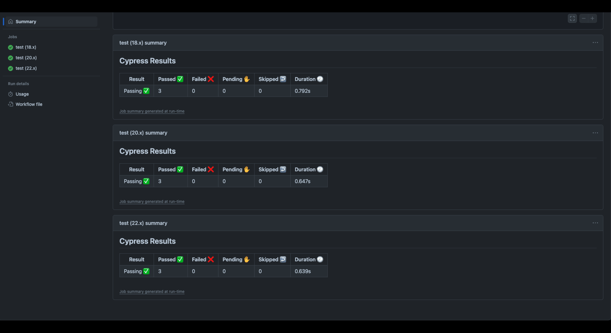

# DevDeploy

## Deployed

https://devdeploy-r7k9.onrender.com

## Description

This project implements a CI/CD pipeline with GitHub Actions to automate testing and deployment. It ensures code quality by running Cypress tests on pull requests to develop and deploying to Render when merged into main. This streamlines development, reduces errors, and enhances efficiency. Through this, I gained hands-on experience with CI/CD, automated testing, and deployment workflows.

## Table of Contents

- [Deployed](#deployed)
- [Description](#description)
- [Installation](#installation)
- [Usage](#usage)
- [Credits](#credits)
- [License](#license)
- [Badges](#badges)
- [Features](#features)
- [Contribute](#how-to-contribute)
- [Tests](#tests)

## Installation

1. Clone Repo
2. npm i
3. Create a .env file and add necessary API keys, database URLs, and secrets.
4. npm run dev
5. Add secrets in GitHub Repository Settings (e.g., RENDER_DEPLOY_HOOK).
6. Ensure the develop and main branches are set up correctly.
7. npx cypress open to test locally
8. Push changes to develop and create a pull request to trigger CI/CD.
9. Merge to main to deploy automatically to Render.

## Usage

1. Cypress Tests and Deployment to Render.
2. Take quiz as often you want to test your knowledge.
3. Review GitHub Actions to see tests and workflows.

## Credits

No Collaborators.

## License

No License

## Badges

  

## Features

Automated Testing with Cypress – Runs component tests on pull requests to the develop branch.
CI/CD with GitHub Actions – Ensures automated workflows for testing and deployment.
Auto Deployment to Render – Deploys the application automatically when merged into main.

## How to Contribute

Fork & Clone Repo and make your own branch to push changes of code to make a PR request.

## Tests

This project uses Cypress for automated testing. Follow these steps to run the tests:

1. npm i
2. npx cypress open
3. npx cypress run
4. Run tests in GitHub Actions to see results
